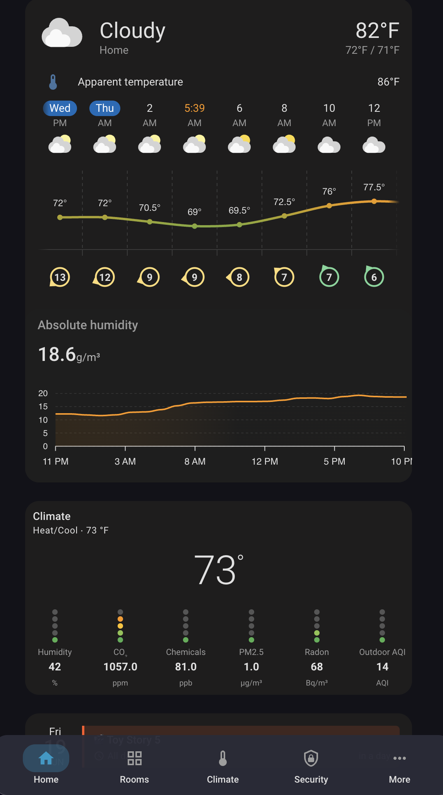
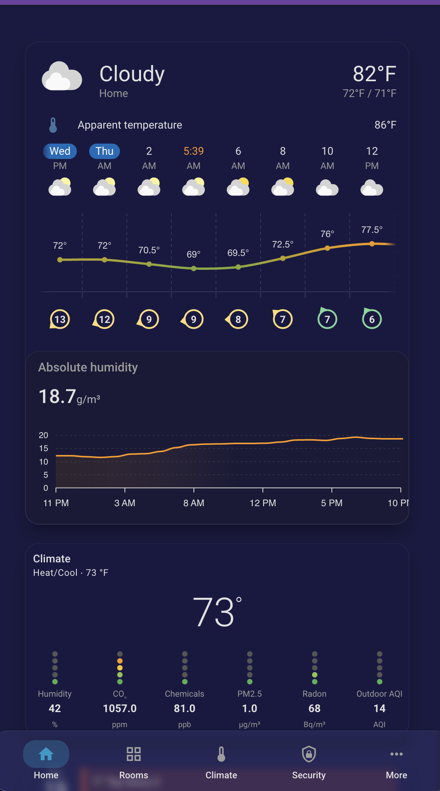
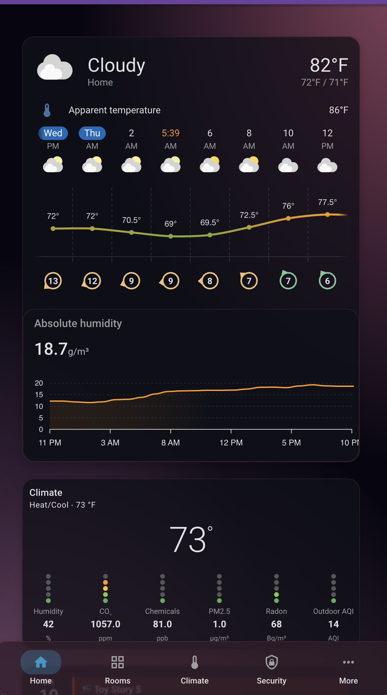
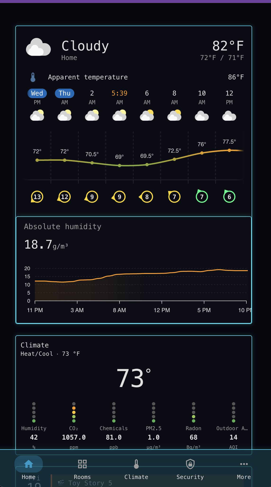
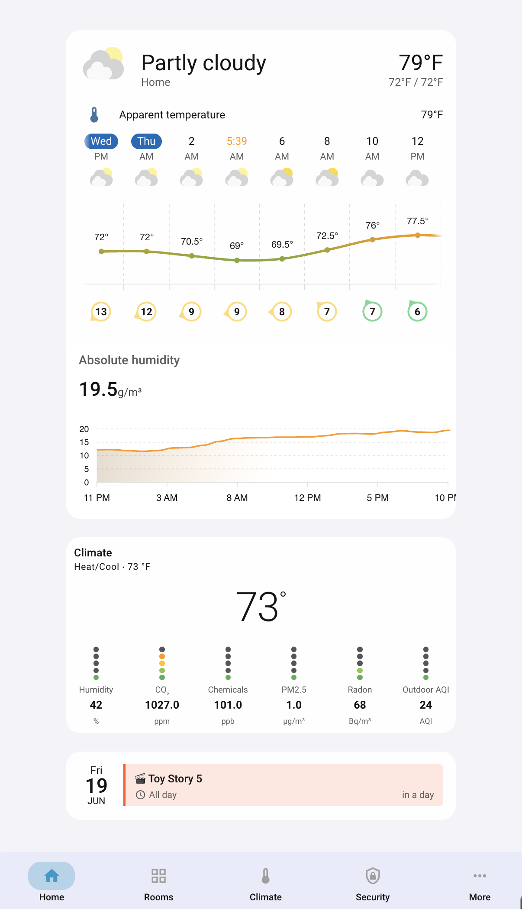
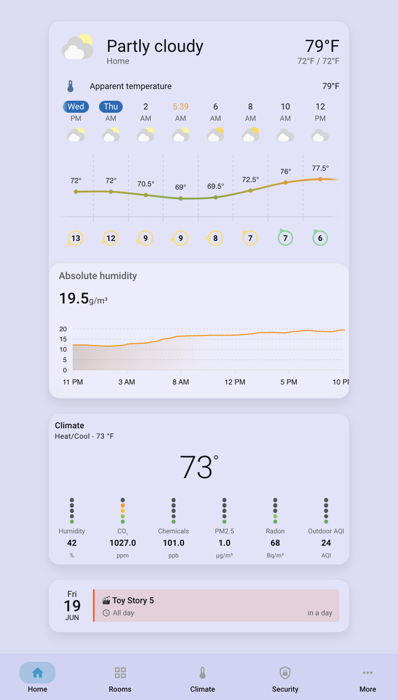
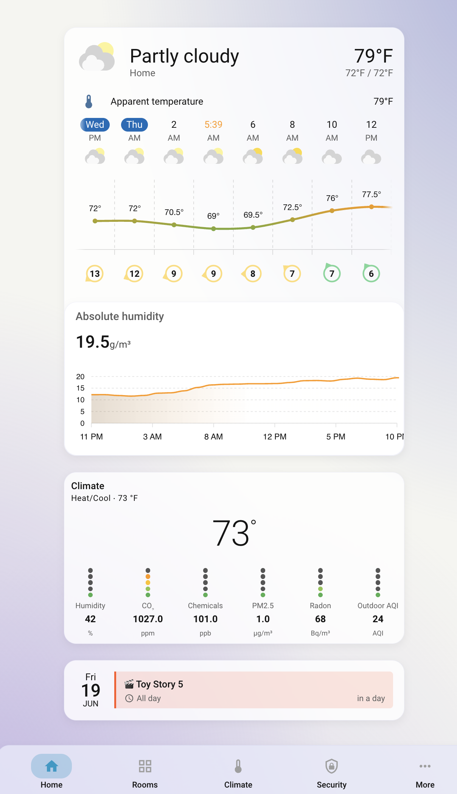
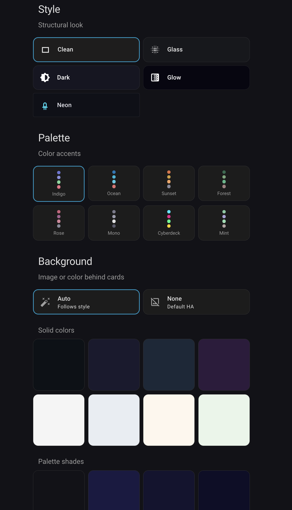

# General Home Mobile Dashboard

A phone-first Home Assistant dashboard with a built-in per-user theme system.
Runs in kiosk mode (no HA header or sidebar) and uses `type: sections` views
with a single-column layout optimized for mobile screens.

The theme system supports 5 visual styles, 8 color palettes, custom
backgrounds, and per-card opacity/blur controls. Each HA account gets its
own independent theme preferences, selected by who is logged in, with a
per-account light/dark/system mode choice.

**HA version tested:** 2026.6.3
**Dashboard mode:** YAML (`mode: yaml`)
**Global theme:** Material You (unchanged — all theming is dashboard-scoped via
card_mod)

---

## Screenshots

### Dark mode

| Clean | Glass | Glow | Cyber Neon |
|:-:|:-:|:-:|:-:|
|  |  |  |  |

### Light mode

| Clean | Glass | Glow |
|:-:|:-:|:-:|
|  |  |  |

---

## Table of Contents

- [Screenshots](#screenshots)
- [Views and Navigation](#views-and-navigation)
- [Required HACS Integrations](#required-hacs-integrations)
- [Setup](#setup)
  - [Dashboard Registration](#1-dashboard-registration)
  - [HACS Cards](#2-hacs-cards)
  - [card_mod Load Order Fix and Popup History Fix](#3-card_mod-load-order-fix-and-popup-history-fix)
  - [Theme Helpers](#4-theme-helpers)
  - [Template Sensors and Theme Macros](#5-template-sensors-and-theme-macros)
  - [Background Image Pipeline](#6-background-image-pipeline)
  - [Conditional Card Helpers](#7-conditional-card-helpers)
  - [REST Sensor (UV Forecast)](#8-rest-sensor-uv-forecast)
  - [Kiosk Mode](#9-kiosk-mode)
- [Theme System](#theme-system)
  - [How Per-User Theming Works](#how-per-user-theming-works)
  - [Four Customization Axes](#four-customization-axes)
  - [Styles](#styles)
  - [Palettes](#palettes)
  - [Backgrounds](#backgrounds)
  - [Card Opacity and Blur](#card-opacity-and-blur)
  - [Appearance Subview](#appearance-subview)
- [Notification System](#notification-system)
- [Architecture](#architecture)
  - [Why Card-Level, Not View-Level](#why-card-level-not-view-level)
  - [Macro Library, Not Sensors](#macro-library-not-sensors)
  - [YAML Anchors and Card Tiering](#yaml-anchors-and-card-tiering)
  - [Background Overlay Card](#background-overlay-card)
  - [Popup History Fix](#popup-history-fix-back-button-behavior)
  - [Duplicate Picker Sections](#duplicate-picker-sections)
- [Deployment](#deployment)
- [Gotchas](#gotchas)
- [File Inventory](#file-inventory)

---

## Views and Navigation

The dashboard has 6 views. The bottom navbar (Material Design 3 style via
`navbar-card`) shows 5 tabs: Home, Rooms, Climate, Security, and More. Rooms
and More open as bubble-card popups rather than navigating to separate views.

| View | Path | Type | Access |
|------|------|------|--------|
| **Home** | `/general-home/home` | Main view | Navbar tab |
| **Climate** | `/general-home/climate` | Subview | Navbar tab |
| **Security** | `/general-home/security` | Subview | Navbar tab |
| **Conditionals** | `/general-home/conditionals` | Subview | More popup |
| **Appearance** | `/general-home/appearance` | Subview | More popup |
| **Automations** | `/general-home/automations` | Subview | More popup |

**Home view contents** (top to bottom):
- Background overlay card (invisible, paints the viewport background)
- "Home" title
- Notification area (promoted chips + dot counter, state-driven)
- Weather card (`weather-forecast-card` + absolute humidity graph)
- Conditional cards (bedtime door status, UV alerts — priority-managed)
- Air quality indicators (humidity, CO2, chemicals, PM2.5, radon)
- Calendar (`calendar-card-pro`)
- Bottom navbar

**Rooms popup:** Room cards with light toggles. Uses template switches that
aggregate all lights in an HA area (excluding presence-detection LEDs).

**More popup:** Navigation links to Appearance, Conditionals, Automations,
3D Printer Farm (links to the Cyberdeck dashboard), and core HA UI.

---

## Required HACS Integrations

Install all of these via HACS before setting up the dashboard:

| Integration | Purpose |
|-------------|---------|
| **card-mod** | CSS injection for all theme styling |
| **bubble-card** | Popup cards for Rooms and More |
| **mushroom** | Template cards, entity cards, chips, title cards |
| **stack-in-card** | Card grouping with unified styling |
| **mini-graph-card** | Sparkline graphs (humidity) |
| **apexcharts-card** | UV index chart |
| **clock-weather-card** | Combined clock/weather display |
| **calendar-card-pro** | Calendar view |
| **navbar-card** | Bottom navigation bar |
| **auto-entities** | Dynamic card generation (background picker) |
| **material-you-utilities** | Material You theme support |
| **kiosk-mode** | Hide HA header and sidebar |

---

## Setup

### 1. Dashboard Registration

Add to your `configuration.yaml` under the `lovelace:` block:

```yaml
lovelace:
  mode: storage        # keep your existing mode
  dashboards:
    general-home:
      mode: yaml
      title: Home
      icon: mdi:home
      show_in_sidebar: true
      filename: dashboards/general_home_mobile/dashboard.yaml
```

### 2. HACS Cards

Install all cards listed in [Required HACS Integrations](#required-hacs-integrations).
Most install via HACS as Lovelace resources. Restart HA after installing.

### 3. card_mod Load Order Fix and Popup History Fix

**card_mod load order is critical.** Without loading it early, card_mod will
intermittently fail to style cards (the calendar, navbar, and background card
are especially affected).

The popup history fix module prevents bubble-card popups from reopening when
using the system back button (intentional design decision). See
[Popup History Fix](#popup-history-fix-back-button-behavior) in Architecture
for details.

Add to `configuration.yaml`:

```yaml
frontend:
  themes: !include_dir_merge_named themes
  extra_module_url:
    - /hacsfiles/lovelace-card-mod/card-mod.js
    - /local/popup_history_fix.js
```

card_mod is loaded during frontend bootstrap, before any cards render. Without
it, card_mod loads as a Lovelace resource in parallel with card rendering, and
any card class that instantiates before card_mod patches it will be permanently
unstyled for that page load.

**Requires an HA restart** (frontend config is read at startup only).

### 4. Theme Helpers

> **Package:** These helpers are defined in `general_home_mobile.yaml` and deployed to
> `packages/` by the sync script.

### 5. Template Sensors and Theme Macros

Two files feed HA's template engine:

| Repo file | Deploy to |
|-----------|-----------|
| `sensors.yaml` | `template_sensors/general_home_sensors.yaml` |
| `general_home_theme.jinja` | `custom_templates/general_home_theme.jinja` |

Your `configuration.yaml` should include:
```yaml
template: !include_dir_merge_list template_sensors
```
(`custom_templates/` needs no registration — HA loads every `.jinja` file in
it automatically.)

After placing the files, reload: `template/reload` for the sensors and
`homeassistant.reload_custom_templates` for the macro library (the sync
script runs both), or restart HA.

**Important:** the repo files reference HA account usernames through the
redaction placeholders `<entity_n>`, and the account user ids through
short-form id keys (see the root README for the entity-map
mechanism). You never edit the tracked files: map the placeholders to your
own accounts in your gitignored `entity_map.yaml` (usernames under
`entities:`, full 32-hex account ids under `ids:`) and the sync script
substitutes the real values in memory on every upload. Also list your
usernames in `config.yaml`'s `redact_entities` so the backup script
re-redacts them on the way back. The one step the scripts can't do for you
is inside HA itself: set each account's display name to match its username,
because card-mod's `user` variable (which selects whose theme renders)
carries the display name, not the username.

### 6. Background Image Pipeline

To enable custom background images on the Appearance page:

**a) Create the folder structure on your HA server:**
```
/config/www/themes/backgrounds/          # drop full-size images here
/config/www/themes/backgrounds/thumbs/   # auto-generated thumbnails
```

**b) Deploy the Python scripts** from this repo:
- `scripts/ha_scripts/list_theme_backgrounds.py` → `/config/scripts/`
- `scripts/ha_scripts/generate_theme_thumbnails.py` → `/config/scripts/`

The thumbnail script requires Pillow (`pip install Pillow`). It generates
~300px wide JPEG thumbnails and cleans up orphaned thumbnails when source
images are deleted.

HA serves everything under `/config/www/` at `/local/`:
- Full image: `/local/themes/backgrounds/mountain.jpg`
- Thumbnail: `/local/themes/backgrounds/thumbs/mountain.jpg`

### 7. Conditional Card Helpers

> **Package migration:** These helpers and their toggle automations are in the
> `general_home_mobile.yaml` package.

The Home view has conditional cards that show/hide based on time of day and
sensor values. A priority-managed template sensor controls which cards are
visible (max 5 at a time).


### 8. REST Sensor (UV Forecast)

> **Package:** This REST sensor is in the `general_home_mobile.yaml` package.

In `secrets.yaml`:
```yaml
openmeteo_uv_url: "https://api.open-meteo.com/v1/forecast?latitude=YOUR_LAT&longitude=YOUR_LON&hourly=uv_index&timezone=YOUR_TZ&forecast_days=1"
```

Do not use `start_hour`/`end_hour` parameters — Open-Meteo returns HTTP 400.
The chart itself limits display to 7 AM–7 PM.

### 9. Kiosk Mode

The dashboard uses kiosk-mode to hide the HA header and sidebar:

```yaml
kiosk_mode:
  hide_header: true
  hide_sidebar: true
```

This is set at the top of `dashboard.yaml`. To access the full HA UI, use the
More popup > "Home Assistant" link, which navigates to `/lovelace/0`.

---

## Theme System

### How Per-User Theming Works

Each HA account has its own set of theme helpers (mode, style, palette,
background, opacity, blur), suffixed with the account's username. Every
themed card's `card_mod` style imports the theme macro library and asks it
for CSS:

```jinja

{{ theme_css(user, 'card') }}
```

`user` is injected by card-mod and equals the viewing account's display name
(display names are set to match usernames). The macro resolves which
account's helpers to read; a session that is neither account falls back to
the primary account's theme (shared wall devices, guests).

The account's **Theme Mode** select decides which variant of its palette
renders:

- **Light** / **Dark** — always that variant; the device's own light/dark
  setting is ignored.
- **System** — the macro emits both variants wrapped in
  `@media (prefers-color-scheme)` queries and the device picks.

Only card_mod `style:` templates receive `user`. Other template contexts on
the dashboard (auto-entities filters, mushroom secondaries) call
`theme_value(account, prop)` with the account name as a literal — safe
because those cards sit inside per-account visibility blocks anyway.

> **Limitation:** Currently exactly two accounts are wired into the macro's resolver
> and the Appearance page. A third user means extending the resolver in
> `general_home_theme.jinja`, adding a helper set, and adding a gated
> Appearance block.

### Four Customization Axes

The theme has four independent axes that can be mixed and matched:

1. **Mode** — light variant, dark variant, or follow the device (System)
2. **Style** — the structural feel (card surfaces, borders, blur, corners)
3. **Palette** — the color tokens (primary, accent, state colors, glow colors)
4. **Background** — what's behind the cards (auto, none, solid color, image)

Changing one axis does not affect the others. The exception is `Auto`
background, which dynamically reflects the current style and palette.

### Styles

| Style | Card Look | Corners | Font | Dark Mode | Light Mode |
|-------|-----------|---------|------|-----------|------------|
| **Clean** | Opaque, flat, no borders | 18px | System | Dark surface, no effects | White surface, no effects |
| **Glass** | Translucent with `backdrop-filter` blur | 18px | System | Frosted dark glass | Frosted light glass |
| **Dark** | Fully opaque, subtle border + shadow | 18px | System | Near-black OLED-friendly | Crisp white with definition |
| **Glow** | Semi-translucent, palette-tinted border | 18px | System | Vivid gradient blobs bleed through | Soft watercolor wash |
| **Neon** | Dark HUD regardless of system theme | **4px** | **Share Tech Mono** | Neon borders, monospace | Same (always dark) |

**Per-style defaults:**

| Style | Card Opacity | Blur | Border |
|-------|-------------|------|--------|
| Clean | 95% | 0px | None |
| Glass | 18% | 12px | Hairline |
| Dark | 100% | 0px | 1px subtle |
| Glow | 75–80% | 2px | Palette-tinted |
| Neon | 70% | 0px | 1px neon primary + glow |

**Neon is intentionally different.** It breaks the "system font / 18px radius"
rules that the other four styles follow. It uses `Share Tech Mono` (loaded via
Google Fonts), 4px sharp corners, and keeps its dark HUD aesthetic even in
light mode. Neon + the Cyberdeck palette recreates the full FARM_CTL/cyberdeck
look.

### Palettes

8 palettes, each defining primary, accent, state colors, and glow blob colors:

| Palette | Primary | Accent | Vibe |
|---------|---------|--------|------|
| **Indigo** (default) | `#6a74d3` | `#6a74d3` | Muted purple-blue |
| **Ocean** | `#0077b6` | `#00b4d8` | Cool ocean blues |
| **Sunset** | `#e07040` | `#d4a03c` | Warm orange/amber |
| **Forest** | `#2d6a4f` | `#74a67a` | Deep earthy greens |
| **Rose** | `#c9607a` | `#a86090` | Pink/mauve |
| **Mono** | `#7a7a8a` | `#9a9aaa` | Neutral gray |
| **Cyberdeck** | `#00e5ff` | `#e91e8c` | Neon cyan/magenta |
| **Mint** | `#7ec8a0` | `#a8a0d6` | Soft green/lavender |

Each palette also defines `--state-on-color`, `--state-off-color`,
`--success-color`, `--warning-color`, `--error-color`, `--info-color`, and
three glow colors for the Glow style's radial gradient blobs.

Every palette and style value lives in one place: the tables at the top of
`general_home_theme.jinja` (semantic colors shared by both modes; glows,
surfaces, and card chrome keyed per mode). Adding a palette is one row per
table plus a picker tile in each account's Appearance block.

### Backgrounds

The background is **independent from the style** — it's stored as a single
string value per user (`input_text.theme_background_<user>`) that can be one
of four types, distinguished by pattern:

| Value | What it paints |
|-------|---------------|
| `auto` | Style-flavored, palette-colored default (see below) |
| `none` | Nothing — HA's stock background shows through |
| `#rrggbb` | Solid color fill |
| `filename.jpg` | Image from `/config/www/themes/backgrounds/` |

**What `Auto` paints per style:**

| Style | Auto Background |
|-------|----------------|
| Clean | Subtle palette-tinted surface |
| Glass | Saturated palette wash (clearly visible behind frosted cards) |
| Dark | Near-black with minimal tint |
| Glow | Vibrant palette radial-gradient blobs |
| Neon | Near-black HUD surface (`#07070d`) |

`Auto` is the factory default and the "smart" option — it re-renders live as
you change style or palette. Solid colors and images are sticky and persist
across style/palette changes.

### Card Opacity and Blur

Two per-user sliders on the Appearance page let you override the style's
default card opacity and blur:

- **Opacity** controls the card background alpha (0–100%)
- **Blur** controls `backdrop-filter` blur in pixels (0–30px). Only visible
  when opacity is below 100%.

Both sliders default to **"follow style default"** (sentinel value `-1`). When
you drag a slider, it switches to a manual override that persists across style
changes. A "Default" chip next to each slider resets it back to following the
current style's default.

### Appearance Subview



Accessed from More popup > Appearance. The page is self-edit: native
per-account visibility conditions show each account only its own controls.
Layout:

1. **Mode picker** — Light / Dark / System tiles
2. **Style picker** — 5 tiles with visual previews (Clean, Glass, Dark, Glow, Neon)
3. **Palette picker** — 8 tiles with 4-dot color swatches
4. **Background picker:**
   - Auto / None toggle
   - Curated color swatches (8 colors)
   - Palette-derived color swatches (4 shades from the active palette)
   - Custom hex input
   - Image thumbnails (from the backgrounds folder)
5. **Card effects** — opacity and blur sliders with "Default" reset chips

---

## Notification System

A two-tier status bar between the "Home" title and the weather card. Items
appear and disappear based on entity state — no manual dismiss, fully
state-driven.

### Two Tiers

1. **Promoted chips** — red severity items (door open) shown as standalone
   `button-card` chips above the dot counter. Each is a `type: conditional`
   card gated on the entity's state.
2. **Dot counter** — all other items rendered as colored dots grouped by
   severity, inside a themed `stack-in-card`. Tapping toggles an expanded
   list showing labels, icons, progress bars, and time remaining.

### Severity Colors

| Color | Hex | Meaning | Examples |
|-------|-----|---------|----------|
| Red | `#ef6461` | Urgent/critical | Doors open |
| Amber | `#e8a840` | Warning/attention | Vacuum running |
| Blue | `#6b9fff` | Informational | Lights on |
| Green | `#3ecf8e` | Normal/running | 3D printer, HVAC, power draw |

### Expand/Collapse

`input_boolean.notification_expanded` controls the expanded list visibility.
Tapping the dot counter toggles it. The `popup_history_fix.js` module
auto-collapses the tray on page load and navigation, so it always starts
collapsed after a refresh.

### Conditional Display: Two Tiers

The dashboard has two ways to conditionally show information when it becomes
relevant. Both are part of the same system — choose the tier that fits the
amount of detail:

**Notification items** (collapsible header bar) — for small, glanceable
status: a count, a label, maybe a progress bar. These appear as colored
dots in the header and expand into a list. Examples: vacuum running, lights on,
power draw.

**Conditional cards** — for information-rich content that need more space: charts,
entity lists, multi-sensor readouts. Examples: UV index forecast chart.

Both tiers show on the **Conditionals page** (`/general-home/conditionals`)
as a combined view of all items whether active or not.

### Adding a New Notification Item

1. Add the entity check to `sensor.dashboard_notifications` in `sensors.yaml`
   (both `state` and `items` attribute — they evaluate independently).
2. Assign a severity: red (urgent), amber (warning), blue (info), green
   (normal)
3. If promoted (red): also add a `type: conditional` chip card in
   `dashboard.yaml` using `*theme_chip_style`
4. If it has progress: include `progress` (0-100) and optional
   `time_remaining` in the item dict

5. The item must always be present in `items` with an `active` flag
   (true when triggered, false when idle). The Home view JS filters
   to active items; the Conditionals page shows everything. Use the
   item's severity when active, `green` when idle.

Notification items do not need a conditional card or an input_boolean.
They appear in the header bar automatically when their `active` flag
is true.

### Adding a New Conditional Card

Use this when the item needs a full card visualization (chart, entity
list, etc.), not just a notification dot.

1. Create `input_boolean.cond_<id>` in `general_home_mobile.yaml`
2. Add on/off automations (time- or state-triggered) in the same file
3. Add the card entry to `sensor.dashboard_conditional_visible` in
   `sensors.yaml` (state template)
4. Add the conditional card in the `dashboard.yaml` Home view, gated on
   the input_boolean
5. Add an unconditional copy of the card to the Conditionals page in
   `dashboard.yaml` (the Conditionals page always shows all cards)

### Key Entities

- `sensor.dashboard_notifications` — aggregation sensor (state = count,
  attrs = items list)
- `input_boolean.notification_expanded` — expand/collapse toggle
- `&theme_chip_style` — YAML anchor for promoted chip cards (theme chrome
  without background/border)

---

## Architecture

### Why Card-Level, Not View-Level

Palette CSS variables at the **view level** via `card_mod`. This does not work
on `type: sections` views in HA 2026.6.

The `card-mod` element created for a sections view **never receives the `hass`
object**. card_mod needs `hass` to evaluate Jinja2 templates like
`{{ theme_css(user, 'card') }}`. Without it, the entire style
string renders to an empty string. All six views in this dashboard use
`type: sections`, so the entire view-level theming layer was a silent no-op.

**Fix:** All Jinja2-driven theming moved to **card-level** `card_mod`. Card-level
card_mod on any card (including markdown, stack-in-card, mushroom, etc.) does
receive `hass` and evaluates Jinja2 correctly.

The view-level anchor (`&theme_view_style`) is kept as an empty string no-op
so existing references don't break.

### Macro Library, Not Sensors

All theme values, and the CSS that carries them, live in one Jinja macro
library, `general_home_theme.jinja`, deployed to HA's `custom_templates/`.
The YAML anchors in `dashboard.yaml` are thin wrappers that import it and
call `theme_css(user, kind)`; the macro reads the viewing account's helpers,
resolves the mode, and emits the complete CSS block server-side.

Why this shape:

- **One source of truth.** Every palette, style default, glow alpha, and
  chrome value is declared exactly once, in the tables at the top of the
  macro file. Adding a palette is one row per table.
- **No 255-char problem.** HA template *sensor states* are capped at 255
  characters (an earlier iteration worked around this with ~40 per-property
  sensors). card_mod template output has no such cap, so the macro can emit
  whole CSS blocks directly and the sensor layer isn't needed at all.
- **Narrow subscriptions.** Each card's template touches only the viewing
  account's own helpers, so one account changing their theme doesn't
  re-render the other account's cards.

> If you ever need a long string from a *sensor*, put it in an **attribute**
> (attributes aren't 255-capped) and read it via `state_attr()`.

### YAML Anchors and Card Tiering

Not every card gets the full theme treatment. The dashboard defines five YAML
anchors at the top of `dashboard.yaml`:

| Anchor | Tier | Purpose | Used on |
|--------|------|---------|---------|
| `&theme_card_style` | Tier 1 | Full themed treatment — palette colors, style surfaces, blur | Content cards (weather, graphs, calendar, entity cards, etc.) |
| `&theme_chip_style` | Tier 1.5 | Theme chrome without background/border — for severity-colored chips | Promoted notification chips |
| `&theme_chrome_style` | Tier 2 | Restrained treatment — tinted background, reduced blur (40% of content) | Navbar, bubble-card popup shells |
| `&theme_exempt_style` | Tier 3 | Strips all styling — transparent background, no border/shadow | Headings, chips, title cards, glance cards |
| `&theme_card_transparent` | — | Transparent background, no border | Wrapper cards (stack-in-card used for grouping) |
| `&theme_bg_card` | — | Background overlay card definition | First card of each view |

Each card gets `card_mod: style: *theme_card_style` (or the appropriate
anchor) and inherits the full CSS block. Cards that need additional custom CSS
(margins, conditional borders, etc.) concatenate it after the anchor
reference.

**Adding a new card:** Give it `card_mod: style: *theme_card_style` for content
cards, or `*theme_exempt_style` if it should be transparent (headings,
decorative elements). If it's inside a themed `stack-in-card`, it may not need
its own `card_mod` at all.

### Background Overlay Card

Because the background can't be set at the view level (see above), it's
painted by a **hidden markdown card** inserted as the first card of each
view's first section. Its `card_mod` makes it:

- `:host` → `position: fixed; height: 0` (no grid space consumed)
- `ha-card` → `position: fixed; inset: 0; z-index: -1` (full viewport, behind
  everything)
- `ha-card ha-markdown` → `display: none` (hide the empty markdown body)

The card's `ha-card` becomes a full-viewport layer that paints the palette
background color and (for the Glow style) the radial-gradient blob overlay.

There is one `*theme_bg_card` per view (6 total). They must remain as the
first card in each view.

### Popup History Fix (Back Button Behavior)

The Rooms and More buttons in the bottom navbar open bubble-card popups
triggered by URL hashes (`#rooms`, `#more`). This creates a browser history
problem: tapping More (`home` → `home#more`) then navigating to a subpage
like Appearance (`home#more` → `appearance`) means pressing the system back
button lands on `home#more` — which reopens the popup instead of returning
to a clean home page.

Bubble-card's `back_open` setting does not fix this. It controls whether
pressing back while the popup is open closes it, but the popup always opens
when the URL hash matches — that's its core mechanism. The hash in the
browser history is the root cause.

**Fix:** A small JavaScript module (`popup_history_fix.js`) intercepts
`history.pushState`. When a navigation happens while the current URL has a
popup hash (`#more` or `#rooms`), the module calls `replaceState` to strip
the hash from the current history entry before the new page is pushed. The
history becomes `home` → `appearance` (the `#more` entry is overwritten),
so system back goes to a clean `home` URL with no popup.

The module is loaded via `frontend.extra_module_url` in `configuration.yaml`
alongside card-mod. It's a global `pushState` override scoped to the two
known popup hashes. If HA's frontend ever migrates from `history.pushState`
to the Navigation API, this module would silently stop working (but not
break anything) and would need to be updated.

**Alternatives considered:**
- `back_open: false` on bubble-card — tested, did not prevent hash-triggered
  opening
- Converting popups to subviews — would fix history naturally but loses the
  slide-up popup UX
- browser_mod popups — no URL hashes, but adds a heavy dependency
- CSS-only drawer via card_mod — would need to reimplement bubble-card's
  popup behavior manually

### Duplicate Picker Sections

The Appearance subview has **two complete copies** of every picker section
(Mode, Style, Palette, Background, Card effects) — one per account, each
wrapped in a `conditional` card whose condition is `condition: user`, so
each account only ever sees its own copy.

This duplication exists because:

1. HA does not support Jinja2 templating inside `tap_action` service call
   `entity_id` fields — you can't write
   `entity_id: input_select.theme_style_{{ current_user }}`, so each copy's
   tap targets are literals pointing at that account's helpers.
2. The style-tile previews are hardcoded per copy (one block previews dark
   surfaces, the other light).

If you add a new style, palette, or mode option, you must add the
corresponding tile in **both** account blocks.

---

## Deployment

### Sync Script

The repo includes a sync script that deploys files to HA via SMB and reloads
the relevant services:

```bash
# Deploy dashboard + sensors + scripts, reload templates
uv run python scripts/general_home_dashboard_sync.py

# Deploy + apply categories and labels to helpers
uv run python scripts/general_home_dashboard_sync.py -c

# Deploy + restart HA (needed for configuration.yaml / frontend changes)
uv run python scripts/general_home_dashboard_sync.py -r
```

The script syncs: `dashboard.yaml`, `sensors.yaml`, `general_home_theme.jinja`
(to `custom_templates/`), `general_home_mobile.yaml` (to `packages/`),
`popup_history_fix.js` (to `www/`), and the two theme Python scripts. It then
runs `homeassistant.reload_custom_templates`, `template/reload`, and
`command_line/reload`. With `-c`, it also creates categories and labels via WebSocket and assigns
them to helper entities. WebSocket is needed because HA categories and labels
are registry-only objects (stored in `.storage/`, not configurable via YAML) —
the only way to create or assign them programmatically is through the
WebSocket API. The script uses its own `smbclient` connection, independent of
any Finder mount.

**Redaction handling:** The sync script un-redacts entity placeholders
(e.g., `<entity_1>` → real names) **in memory only** before writing to HA.
Local files on disk are never modified, so git sees no changes after a sync.
This is different from the backup script's `-r` restore, which writes
un-redacted content back to local files (and therefore shows up in
`git diff`).

### Force-Refreshing the Dashboard

HA caches the Lovelace YAML config. After deploying a dashboard change, you
need to force a fresh read. Run this in the browser console (or via a
JavaScript tool):

```js
const ha = document.querySelector('home-assistant');
ha.hass.callWS({ type: 'lovelace/config', url_path: 'general-home', force: true });
```

Then reload the page.

### Validating Config Before Restart

```bash
curl -s -X POST "http://YOUR_HA:8123/api/config/core/check_config" \
  -H "Authorization: Bearer YOUR_TOKEN"
```

---

## Gotchas

### After Any HA Restart

1. **SMB share drops.** If you mount `/config` via Finder, you'll need to
   remount after every restart. The sync script uses its own SMB connection and
   is unaffected.

2. **Template sensors get stuck at `unknown`.** Run `template/reload`
   (Developer Tools > YAML > Template Entities, or
   `POST /api/services/template/reload`) after a restart. The theme itself
   is macro-rendered, not sensor-based — after editing
   `general_home_theme.jinja`, run `homeassistant.reload_custom_templates`
   and refresh the page.

3. **`initial:` helpers reset.** If your `input_select`/`input_number` helpers
   have `initial:` set, they reset to that value on restart. Remove `initial:`
   lines to persist the last-set value across restarts.

### card_mod Timing

card_mod works by monkey-patching the `hass` setter on card element classes.
If a card class instantiates **before** card_mod loads, that card will never
be styled. The `extra_module_url` fix (see
[Setup](#3-card_mod-load-order-fix-and-popup-history-fix))
addresses this, but if you ever see unstyled cards, the load order is the
first thing to check.

**Do not try to fix this with delays.** card_mod does not retroactively style
cards it missed. The fix is load order, not patience.

### Sensor State 255-Char Limit

HA template sensor states are capped at 255 characters. Any sensor state that
exceeds this goes `unavailable` — keep states short and put long values in
attributes (read via `state_attr()`, uncapped). The theme system sidesteps
the cap entirely: its CSS is rendered by card_mod templates importing the
macro library, and card_mod template output has no such limit.

### Entity ID vs. Unique ID

HA derives entity IDs from the sensor's friendly **name**, not its `unique_id`.
A sensor with `unique_id: foo_bar` but `name: "Foo Bar Something"` gets
entity ID `sensor.foo_bar_something`. The dashboard references the entity
ID form (derived from the name). Don't assume the unique_id matches.

### Verifying card_mod Applied

To check if card_mod actually applied to a card, open the browser console and
walk the shadow DOM: `home-assistant` > `home-assistant-main` >
`ha-panel-lovelace` > `hui-root` > `#view hui-view` > `hui-sections-view` >
`hui-grid-section[]`. Find a card's `ha-card` element and run:

```js
getComputedStyle(haCard).getPropertyValue('--primary-color')
```

If it returns the palette color (e.g., `#6a74d3`), card_mod applied. If it
returns `#009ac7` (Material You default), it didn't. If it returns nothing
or `unknown`, card_mod applied but the macro render failed — check that
`custom_templates/general_home_theme.jinja` is deployed, run
`homeassistant.reload_custom_templates`, and confirm the theme helpers exist.

### Neon Font Loading

The Neon style loads `Share Tech Mono` via a Google Fonts `@import` in the
card_mod CSS. This means the first render after a fresh page load may briefly
show the system font before the web font loads. The `@import` is
conditionally included only when the viewing account's style is Neon, so it
doesn't slow down other styles.

### Light-Mode Glow Blending

The Glow style uses `mix-blend-mode: screen` in dark mode (lightens the glow
over the dark base) and `mix-blend-mode: multiply` in light mode (darkens the
pastel glow into the light base for a watercolor-wash effect). The light-mode
overlay opacity is set to 0.85 (vs 1.0 for dark mode) to keep the wash
subtle. If glow colors look too faint or too strong, adjust the glow alphas
in the `palette_by_mode` table in `general_home_theme.jinja`.

### APIs That Don't Work in 2026.6

- `POST /api/services/lovelace/reload` → 400
- `POST /api/lovelace/reload` → 404
- `POST /api/error_log`, `/api/error/all` → 404

Use the WebSocket `lovelace/config` call with `force: true` to reload YAML
dashboards. Use `POST /api/config/core/check_config` to validate config.

---

## File Inventory

### Repo Files

| File | Purpose |
|------|---------|
| `dashboard.yaml` | All views, theme YAML anchors, and card definitions |
| `general_home_theme.jinja` | Theme macro library — every palette/style value plus the CSS-emitting macros (deployed to `custom_templates/`) |
| `sensors.yaml` | Non-theme template sensors (conditional card manager, notification aggregator, room light switches) |
| `general_home_mobile.yaml` | HA package: helpers, REST sensor, command_line, shell_command, automations (deployed to `packages/`) |
| `registry_metadata.yaml` | Category and label definitions applied via sync script `-c` flag |
| `popup_history_fix.js` | Fixes system-back reopening bubble-card popups (deployed to `www/`) |
| `ha_config_additions.yaml` | Remaining HA config that can't go in a package |
| `README.md` | This file |

General-purpose sensors the dashboard consumes live in repo-root `packages/`, synced to
HA's `packages/` directory by the same sync script.

### Scripts

| Script | Purpose |
|--------|---------|
| `scripts/general_home_dashboard_sync.py` | SMB deploy + service reload (runs locally) |
| `scripts/ha_scripts/generate_theme_thumbnails.py` | Creates ~300px JPEG thumbnails for the background picker (deployed to HA) |
| `scripts/ha_scripts/list_theme_backgrounds.py` | Lists background images as JSON for the command_line sensor (deployed to HA) |

### Server Files (`/config/`)

| Path | Purpose |
|------|---------|
| `configuration.yaml` | Must include `frontend.extra_module_url` for card_mod and popup history fix |
| `packages/general_home_mobile.yaml` | Deployed package (helpers, sensors, shell_command, automations) |
| `packages/general.yaml` | Deployed general package (house-wide config, from repo-root `packages/`) |
| `www/popup_history_fix.js` | Deployed copy of popup history fix module |
| `custom_templates/general_home_theme.jinja` | Deployed theme macro library |
| `template_sensors/general_home_sensors.yaml` | Deployed copy of general sensors |
| `www/themes/backgrounds/` | User-uploaded background images |
| `www/themes/backgrounds/thumbs/` | Auto-generated thumbnails |
| `scripts/generate_theme_thumbnails.py` | Deployed copy |
| `scripts/list_theme_backgrounds.py` | Deployed copy |

### Key Entities

**Helpers (per account, suffixed with the account's username):**
- `input_select.theme_mode_<username>` — Light / Dark / System
- `input_select.theme_style_<username>` — Clean / Glass / Dark / Glow / Neon
- `input_select.theme_palette_<username>` — Indigo / Ocean / Sunset / Forest / Rose / Mono / Cyberdeck / Mint
- `input_text.theme_background_<username>` — auto / none / #hex / filename
- `input_number.theme_card_opacity_<username>` — -1 (follow default) to 100
- `input_number.theme_card_blur_<username>` — -1 (follow default) to 30

**Macros (`general_home_theme.jinja`):**
- `theme_css(user, kind)` — a card's full card_mod CSS; `kind` is `card`,
  `exempt`, `chip`, or `chrome` (matching the four YAML anchors)
- `view_background_css(user)` — the page background + Glow orb overlay
- `theme_value(account, prop)` — single resolved values (`primary`,
  `card_opacity`, `card_blur`, `account`) for non-card_mod templates, which
  don't receive `user` and must pass the account name as a literal
